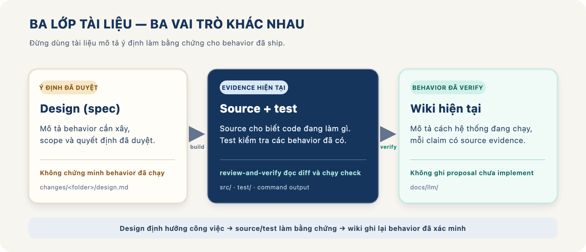
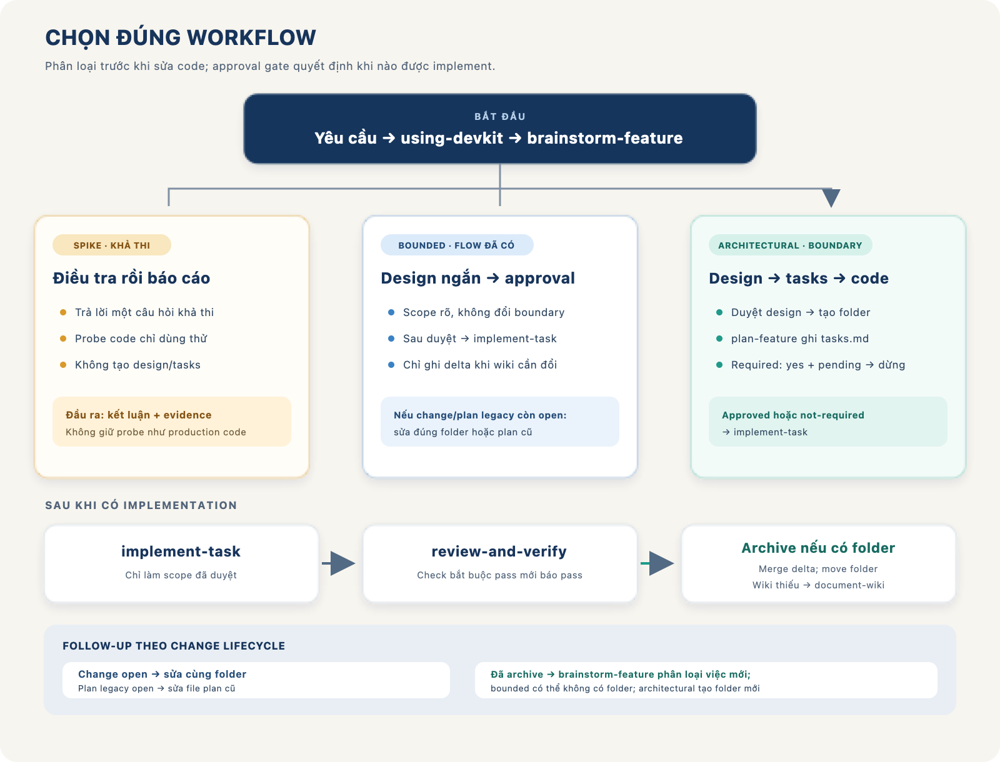
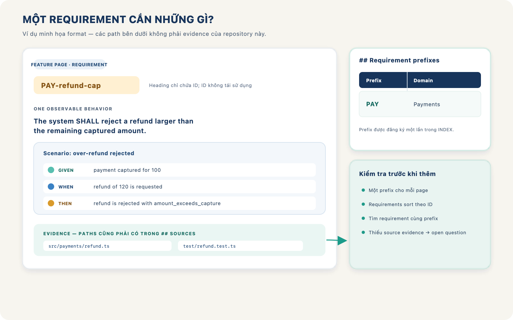

# Hướng dẫn agent-devkit (tiếng Việt)

Bản tiếng Việt của [GUIDE.md](GUIDE.md), mở rộng theo hướng training team: cài đặt, bootstrap, cách chọn skill, đi qua các bước từ yêu cầu đến review, hiểu các loại tài liệu được tạo và biết folder nào xuất hiện trong từng workflow. Khi làm task thật, luôn đọc AGENTS.md của project đích và làm theo hướng dẫn đầy đủ của skill đang dùng.

## 1. Mô hình làm việc

agent-devkit là bộ playbook Markdown cho coding agent. Skill hướng dẫn agent làm việc theo quy trình; nó không phải thư viện ứng dụng và không tự chạy business logic.

Ba loại tài liệu cần phân biệt:

| Tài liệu | Trả lời câu hỏi | Nguồn nội dung |
|---|---|---|
| Design trong `docs/agent-devkit/changes/<folder>/design.md` | Sắp xây gì? Vì sao? Phạm vi và quyết định nào đã được duyệt? | Ý định đã được người dùng duyệt |
| Tasks trong `docs/agent-devkit/changes/<folder>/tasks.md` | Sẽ implement bằng task nào và kiểm tra ra sao? | Design đã duyệt và source hiện tại |
| Wiki trong docs/llm/ | Hệ thống hiện đang hoạt động thế nào? | Source và test đã kiểm chứng |



*Design ghi ý định; source và test chứng minh implementation; wiki mô tả behavior hiện tại đã có evidence.*

Design và tasks mô tả công việc dự kiến. Chúng không chứng minh behavior đã được release. Spec/plan cũ vẫn nằm trong `docs/agent-devkit/specs/` và `plans/`. Wiki chỉ ghi behavior có bằng chứng từ source/test; không chép ý tưởng chưa implement vào wiki.

Agent phải đọc AGENTS.md của project đích trước khi sửa. Nếu một skill tham chiếu quy tắc chung trong using-devkit mà skill đó chưa được nạp, hãy đọc using-devkit. Nếu không tìm thấy, dừng ở bước cần quy tắc đó và báo thiếu skill; đừng tự đoán.

## 2. Cài đặt

Cài **nguyên bộ** `skills/` — các skill handoff cho nhau và load file trong `references/` khi cần, nên thiếu một skill có thể làm workflow kia dừng.

**Plugin theo client** (khuyến nghị):

| Client | Lệnh |
|---|---|
| Claude Code | `claude plugin marketplace add asta-nguyen/agent-devkit` rồi `claude plugin install agent-devkit@agent-devkit` |
| Codex | `codex plugin marketplace add asta-nguyen/agent-devkit --ref main` rồi `codex plugin add agent-devkit@agent-devkit` |
| Devin CLI | `devin plugins install asta-nguyen/agent-devkit` |
| Cursor | import `.cursor-plugin/marketplace.json` qua team marketplace, hoặc đặt repo tại `~/.cursor/plugins/local/agent-devkit` rồi reload |
| OpenCode | thêm `agent-devkit@git+https://github.com/asta-nguyen/agent-devkit.git` vào `plugin` trong `opencode.json` rồi restart |

**Agent Skills CLI:**

```bash
npx skills add asta-nguyen/agent-devkit -a claude-code
```

Repository public là `asta-nguyen/agent-devkit` (không phải `asta/agent-devkit`).

**Copy thủ công** — với host discover repository-local skills từ `.agents/skills`:

```bash
mkdir -p .agents/skills
cp -R /path/to/agent-devkit/skills/. .agents/skills/
find .agents/skills -name SKILL.md -print
```

Với cách cài này, tại root project chạy validator bằng
`node .agents/skills/document-wiki/scripts/validate-llm-wiki.mjs .`.

Chi tiết và câu lệnh update cho từng client: [README tiếng Việt — Sử dụng skills](README.vi.md#sử-dụng-skills). OpenEZ (semantic index) và FFF (fuzzy search) là tùy chọn, chỉ đáng cài trong repo lớn — xem [GUIDE.md §2](GUIDE.md#2-installation).

## 3. Bootstrap và hook

Mỗi packaging đăng ký một `SessionStart` hook để inject `using-devkit` vào đầu session:

| Client | Hook |
|---|---|
| Codex | `.codex-plugin/` + `hooks/hooks.json` |
| Claude Code | `.claude-plugin/` + `hooks/claude-codex-hooks.json` |
| Cursor | `.cursor-plugin/` + `hooks/cursor-hooks.json` |
| Devin CLI | `.devin-plugin/` + `hooks.json` ở root |
| OpenCode | `.opencode/plugins/agent-devkit.js` |

Sau khi cài:

- **Restart agent session** để skill list reload.
- **Kiểm tra marker `AGENT-DEVKIT:ACTIVE`** trong session mới. Plugin hooks có thể fail-open (nhất là Devin CLI/Desktop); nếu không thấy marker, gọi `using-devkit` thủ công trước khi bắt đầu task.
- **Không tùy biến** skill files trong project đích — update sẽ ghi đè file cùng tên; skill folder đã retired phải tự xóa.
- Copy **nguyên folder** mỗi skill kèm `references/` đi cùng.

## 4. Bắt đầu và gọi skill

Bắt đầu task bằng cách yêu cầu agent chọn workflow phù hợp qua using-devkit. Tên gọi chính xác phụ thuộc host: có host dùng tên skill trần, có host hiển thị namespace như agent-devkit:brainstorm-feature. Nếu không chắc cú pháp, yêu cầu agent gọi skill theo tên trong skill list.

Ví dụ yêu cầu mở đầu:

~~~text
Dùng using-devkit để chọn workflow. Đọc AGENTS.md, xác định skill sở hữu task
này, rồi làm theo các approval gate trước khi sửa code.
~~~

Nếu thiếu using-devkit, skill tham chiếu nó phải dừng và báo thiếu. SKILL.md là playbook chính; metadata UI nếu có chỉ bổ sung giao diện.

## 5. Chọn đúng workflow

| Nhu cầu | Skill bắt đầu | Kết quả thường thấy |
|---|---|---|
| Không rõ nên dùng quy trình nào | using-devkit | Định tuyến sang skill sở hữu |
| Hiểu code path, caller, test hoặc impact | read-codebase-context | Sơ đồ entry → caller/callee → test và evidence |
| Repo mới hoặc thiếu context | setup-codebase | Tạo context file/wiki skeleton còn thiếu |
| Ý tưởng mới hoặc yêu cầu còn mơ hồ | brainstorm-feature | Phân loại, làm rõ, đề xuất design và xin approval |
| Design kiến trúc đã duyệt, cần task để implement | plan-feature | Plan chi tiết, Approval Gate và verification |
| Bắt đầu code theo design/plan đã duyệt | implement-task | Thay đổi code theo task và ghi evidence |
| Xác minh diff trước khi kết thúc | review-and-verify | Kết quả pass/fail cùng blocker và Spec gaps |
| Bug, test fail, behavior bất ngờ | systematic-debugging | Điều tra root cause rồi fix hoặc chuyển sang design |
| Tạo/refresh wiki từ source hiện tại | document-wiki | Domain map, feature inventory, các trang được chọn |
| Ước lượng effort theo task | estimate-feature | Bảng estimate; chỉ chạy khi được yêu cầu |
| Cần tạm dừng task đang dở | context-handoff | Handoff ngắn để session sau tiếp tục |
| Audit over-engineering toàn repo | lean-audit | Finding có evidence; chỉ report, không tự fix |
| Cần code intelligence/OpenEZ | setup-openez | Cài hoặc refresh khi cần và được duyệt |

Các mũi tên trong workflow nghĩa là phải handoff theo thứ tự. Handoff thường là agent báo người dùng gọi skill kế tiếp; cú pháp tự gọi skill tùy host. Đừng bỏ qua approval gate vì thấy đã có spec hoặc user đã nói “làm đi” trước khi plan high-impact được viết.

### Mẫu yêu cầu team có thể dùng

~~~text
Dùng read-codebase-context để trace luồng tạo invoice, caller và test liên quan.
Chỉ báo cáo source/evidence; chưa sửa code.
~~~

~~~text
Test refund đang fail. Dùng systematic-debugging, reproduce và tìm root cause
trước; chưa sửa cho đến khi có verify plan.
~~~

~~~text
Dùng document-wiki để kiểm tra wiki hiện có. Lập domain map và feature
inventory trước, rồi đưa các feature đủ điều kiện cho tôi chọn refresh.
~~~

~~~text
Review diff hiện tại với plan đã duyệt bằng review-and-verify. Chạy các check
bắt buộc, báo evidence và mọi spec gap; không commit.
~~~

~~~text
Tạo estimate theo từng task của plan này bằng estimate-feature. Không bắt đầu
implement.
~~~

~~~text
Task còn dở và tôi cần chuyển session. Dùng context-handoff, ghi lại evidence,
changed files, remaining work và next action rồi dừng.
~~~

## 6. Luồng feature từ yêu cầu đến triển khai



*Mọi nhánh có implementation đều qua review-and-verify. Final review archive change folder khi có; document-wiki xử lý wiki coverage ngoài delta.*

### Spike

Dùng cho câu hỏi khả thi như “có làm được không?”. Đầu ra là kết luận và bằng chứng, không phải feature được giữ lại. Có thể viết probe code throwaway nếu cần, nhưng phải nói rõ nó không phải production implementation. Không tạo spec hoặc plan cho Spike.

### Bounded

Dùng khi flow cần thay đổi đã tồn tại, phạm vi rõ và không thay shared contract, API, schema, security boundary hoặc phần có impact rộng. Với yêu cầu mới không gắn với change hay plan legacy đang open, agent hỏi các câu cần thiết, trình bày design ngắn trong chat và chờ approval; thường không tạo `design.md` hoặc `tasks.md`. Nếu follow-up thuộc change còn open, sửa đúng folder đó (`delta.md` qua brainstorm-feature, `tasks.md` qua plan-feature khi có task mới). Nếu plan legacy còn open, plan-feature sửa chính file plan đó. Sau approval phù hợp, đi qua implement-task rồi review-and-verify.

Ví dụ yêu cầu cho flow hiện có:

~~~text
Trong handler đang có, thêm flag includeArchived. Chỉ áp dụng cho endpoint
GET /items. Dùng brainstorm-feature để kiểm tra impact trước, rồi chờ tôi duyệt
design.
~~~

Chỉ dùng explicit-change lane khi yêu cầu chỉ rõ file/symbol, kết quả không mơ hồ và impact map chứng minh mọi caller/test/config nằm trong phạm vi. Lane này không dùng cho bug fix hoặc thay đổi API/schema/security.

### Architectural

Dùng khi tạo subsystem mới, thay interface mà nhiều phần phụ thuộc, hoặc thay boundary giữa components. Agent làm rõ scope và behavior, trình bày design để xin duyệt. Sau approval, brainstorm-feature tạo change folder với `design.md`, thêm `delta.md` khi requirement trong wiki cần đổi, tự kiểm tra các file và link folder trong `docs/agent-devkit/INDEX.md`. plan-feature viết `tasks.md` cùng folder.

~~~text
Tôi muốn thêm payment reconciliation cho nhiều provider. Dùng brainstorm-feature,
làm rõ behavior, failure/retry và boundary; trình bày design để tôi duyệt, rồi
ghi design.md trong change folder và dùng plan-feature lập tasks.md. Chưa implement.
~~~

Approval của design cho phép tạo `tasks.md`; nó không thay approval của plan high-impact. Nếu `tasks.md` có `Required: yes`, gate bắt đầu bằng `Status: pending` và agent dừng trước khi sửa application code. Người dùng cần duyệt toàn bộ tasks. Material change trên change hoặc plan legacy đang open có thể khiến approval gate quay về pending.

## 7. Change folder và vòng đời plan legacy

`tasks.md` (hoặc plan legacy) là danh sách công việc, không phải chỗ viết sẵn code. Mỗi task cần nói rõ file/symbol, interface, behavior cần đổi và cách verify. Tasks phải bao phủ edge case đã được duyệt; nếu còn quyết định làm thay đổi behavior hoặc scope, quay lại brainstorm-feature.

Change mới nằm trực tiếp dưới `docs/agent-devkit/changes/` khi còn open. `tasks.md` có `## Approval Gate` và `## Decision Log` nhưng không có field `Execution`. Sau khi mọi task và verification bắt buộc pass, `review-and-verify` merge `delta.md` vào wiki khi có delta, rồi chuyển folder sang `changes/archive/` và cập nhật INDEX cùng các link. Bước archive đánh dấu change complete; change không có delta vẫn được chuyển folder sau final review.

Plan legacy trong `docs/agent-devkit/plans/` có `## Approval Gate` dùng `Status` và `Execution: open | complete`. `Status` cho biết plan đã được duyệt để thi hành chưa; `Execution` cho biết final review của chính plan đã hoàn tất chưa. Chỉ final review-and-verify của plan đó mới đặt `Execution: complete` sau khi mọi task đã implement và mọi verification bắt buộc pass.

Không đặt `Execution: complete` chỉ vì spec hoặc plan legacy được approve, task đã được đọc, hay agent đã chạy một lần.

| Trạng thái liên quan | Cách xử lý follow-up |
|---|---|
| Change còn open | Sửa các file trong chính folder đó; giữ kết quả đã xong và thêm task mới qua plan-feature khi cần. |
| Change đã archive | Đưa yêu cầu mới qua brainstorm-feature; Architectural tạo change folder mới, Bounded có thể không cần folder. |
| Plan legacy còn open | Dùng plan-feature sửa chính file plan đó tại chỗ, giữ tên file và kết quả của task đã xong. |
| Plan legacy đã complete | Đưa yêu cầu mới qua brainstorm-feature; không nối task mới vào plan cũ. Design mới có `## Previous work` link tới artifacts trước. |
| Plan legacy có task hoàn thành nhưng thiếu field | Đọc bằng chứng task và verification trước khi coi plan là active/completed. Không suy ra complete chỉ từ Status: approved. |

Plan legacy có ## Approval Gate nhưng thiếu Execution: final review pass sẽ thêm/set field trong Approval Gate. Nếu plan không có ## Approval Gate, skill review dùng ## Completion. Không sửa plan cũ thành complete chỉ vì vừa đọc nó.

Ví dụ: hôm nay có thêm yêu cầu “hỗ trợ sub” sau khi change hôm qua đã archive. Change cũ là lịch sử. Nếu thay đổi bounded, brainstorm phân loại lại rồi handoff implement; nếu thay đổi kiến trúc, tạo change folder mới và link tới artifacts trước trong `## Previous work`. Nếu change cũ vẫn open, cập nhật đúng folder đó.

## 8. Implement và review

implement-task đọc AGENTS, `design.md`, `tasks.md`, `delta.md` liên quan, context và source trước khi sửa; với việc legacy, đọc spec/plan cũ. Nó chỉ thực hiện scope được duyệt và task còn lại. Khi phát hiện behavior ngoài dự kiến hoặc yêu cầu mới, agent dừng để phân loại/approval lại; không âm thầm nới scope. Quyết định trong change ghi vào `decisions.md`; material change cũng cập nhật Decision Log và approval gate của `tasks.md`. Việc ngoài change dùng artifact quyết định phù hợp.

Sau implementation, dùng review-and-verify. Đây là review theo diff và yêu cầu, không chỉ là chạy test:

1. Đối chiếu từng yêu cầu/task với diff và source.
2. Chạy verification bắt buộc theo plan, AGENTS, manifest hoặc CI.
3. Đọc toàn bộ output, kể cả warning và failure.
4. Tìm spec gap khi chưa đủ evidence; ghi rõ lệnh hoặc bằng chứng còn thiếu.
5. Kiểm tra stale docs, caller, boundary bảo mật, error handling và scope ngoài plan.
6. Phân loại ảnh hưởng tới wiki. Nếu wiki mô tả behavior đã đổi nhưng chưa được refresh, ghi handoff và chưa báo pass.

Review kết thúc bằng result block có Status, Evidence, Blockers, Non-blockers, Spec gaps, Wiki impact, Wiki pages và Wiki action. Chỉ nói pass khi tất cả yêu cầu và verification bắt buộc có evidence mới. Verification chưa chạy hoặc không thể chạy không được đổi thành pass; ghi cụ thể cannot verify và lý do.

## 9. Wiki và format Requirements

document-wiki chỉ ghi behavior đã kiểm chứng từ source/test. Trước khi viết trang sâu, agent lập domain map và feature inventory, xác định coverage, rồi trình bày trang chưa có hoặc có content gap đã xác minh để người dùng chọn. Khi wiki trống/skeleton, skill tự tạo baseline overview; việc đó không tự động cho phép tạo trang sâu cho mọi feature.

Feature page dùng ## Requirements thay cho ## Business rules khi trang được tạo mới hoặc refresh. Mỗi requirement có dạng:

~~~md
## Requirements

### PAY-refund-cap

The system SHALL reject a refund larger than the remaining captured amount.

#### Scenario: over-refund rejected

- GIVEN a payment captured for 100
- WHEN a refund of 120 is requested
- THEN the refund is rejected with amount_exceeds_capture

Evidence: src/payments/refund.ts, test/refund.test.ts

## Flow
Source-grounded happy path.

## Tests
test/refund.test.ts

## Sources
- src/payments/refund.ts
- test/refund.test.ts
~~~

Đây là ví dụ minh họa format, không phải evidence của code trong repository này.



*Requirement có ID ổn định, behavior rõ, scenario kiểm tra được và evidence trỏ về source/test.*

Quy tắc requirement:

- ID là PREFIX-slug: prefix viết hoa theo domain; slug lowercase kebab-case.
- Heading chỉ chứa ID, ví dụ ### PAY-refund-cap. Anchor ổn định là #pay-refund-cap; link tới requirement dùng relative Markdown link kèm anchor.
- Một requirement có đúng một câu SHALL mô tả behavior quan sát được.
- Có ít nhất một #### Scenario: gồm GIVEN, WHEN, THEN. Dùng test khi có test liên quan; nếu không, lấy tình huống từ source.
- Có một dòng Evidence: với exact path tới source và test liên quan nếu có. Mỗi evidence path phải tồn tại và cũng có trong ## Sources.
- Requirement không có evidence từ source là open question, không phải requirement.
- Requirement trong một page phải được sort theo ID. Mỗi page dùng một prefix duy nhất.
- Prefix được đăng ký trong ## Requirement prefixes ở docs/llm/INDEX.md, dạng bảng Prefix | Domain. Dùng lại prefix hiện có của domain; thêm prefix mới khi domain chưa có. Bảng chỉ cần tạo khi đăng ký prefix đầu tiên.
- Trước khi thêm requirement, tìm tất cả page dùng prefix đó. Nếu behavior đã có requirement, reuse ID/link; không tạo ID slug khác cho cùng behavior.
- Requirement bị xóa không được tái sử dụng ID. Rule dùng chung nhiều page có một home; page khác link về ID đó.
- Không biến proposal, ý tưởng sản phẩm hoặc behavior chưa implement thành requirement.

Trang cũ có ## Business rules tiếp tục hợp lệ cho tới khi refresh chính trang đó. Khi refresh, chuyển các rule có evidence thành requirements; đưa rule chưa đủ evidence thành open questions. Không bulk migrate mọi trang chỉ vì format mới có mặt.

Ví dụ registry trong INDEX:

~~~md
## Requirement prefixes

| Prefix | Domain |
|---|---|
| PAY | Payments |
~~~

Ví dụ link từ trang khác:

~~~md
[PAY-refund-cap](../domains/payments.md#pay-refund-cap)
~~~

document-wiki chạy `scripts/validate-llm-wiki.mjs` trong folder skill sau khi ghi wiki để kiểm source paths, Sources, relative links và anchors, ID trùng, prefix registry, thứ tự ID, SHALL/scenario và evidence. review-and-verify chạy lại script sau khi merge delta, trước khi archive. Agent vẫn tự kiểm duplicate behavior và việc evidence có thật sự hỗ trợ requirement. Một test pass không đủ để chứng minh các phần ngữ nghĩa đó.

Thiết kế chia bốn phần: truth layer (format Requirements), change folder, archive merge delta vào wiki, và validator script. Validator nằm trong `skills/document-wiki/scripts/` và nhận root của project đích làm tham số; CI của project chỉ chạy nó nếu team cấu hình thêm.

## 10. Những folder nào xuất hiện?

Đây là **danh mục đầy đủ** những folder/file devkit có thể tạo trong một project. Không cái nào bắt buộc toàn cục: mỗi cái chỉ xuất hiện khi điều kiện ở cột “Xuất hiện khi” đúng.

| Folder / file | Nhóm | Xuất hiện khi | Skill tạo |
|---|---|---|---|
| `AGENTS.md` | context | Contract của project (thường luôn có) | setup-codebase |
| `CLAUDE.md` | context | Khi setup-codebase chạy | setup-codebase |
| `CONVENTIONS.md` | context | Khi có convention cần lưu riêng | setup-codebase |
| `docs/agent-devkit/INDEX.md` | process | Process artifact đầu tiên được tạo | skill tạo artifact đầu tiên |
| `docs/agent-devkit/specs/` | process (legacy) | Architectural design được duyệt (việc cũ) | brainstorm-feature |
| `docs/agent-devkit/plans/` | process (legacy) | Sau khi spec được duyệt (việc cũ) | plan-feature |
| `docs/agent-devkit/decisions/` | process | Quyết định của việc không thuộc change hay plan/spec active | implement-task |
| `docs/agent-devkit/estimates/` | process | Estimate được yêu cầu cho plan legacy | estimate-feature |
| `docs/agent-devkit/handoffs/` | process | Checkpoint của việc không thuộc change folder | context-handoff |
| `docs/agent-devkit/changes/<folder>/` | process | Change còn open: Architectural có `design.md` và `tasks.md`, thêm `delta.md` khi cần; Bounded chỉ có `delta.md` khi cần. Bounded không có artifact thì không tạo folder. `estimate.md` cần `tasks.md`; decision và handoff tùy chọn nằm cùng folder | brainstorm-feature, plan-feature, implement-task |
| `docs/agent-devkit/changes/archive/<folder>/` | process | Sau khi `review-and-verify` archive một change đã verify | review-and-verify |
| `docs/llm/AGENTS.md` | wiki | Wiki skeleton được tạo | setup-codebase |
| `docs/llm/INDEX.md` | wiki | Wiki skeleton; và khi thêm `## Requirement prefixes` | setup-codebase, document-wiki |
| `docs/llm/FEATURES.md` | wiki | Chỉ khi file đã tồn tại | document-wiki (chỉ update) |
| `docs/llm/LOG.md` | wiki legacy | Không bao giờ tạo mới; giữ nguyên nếu đã có | — |
| `docs/llm/architecture/overview.md` | wiki | Baseline map | document-wiki |
| `docs/llm/{architecture,domains,workflows,integrations,operations,decisions}/` | wiki category | Khi có page thật thuộc category | document-wiki |
| `.agents/skills/` | cài đặt | Host dùng local Agent Skills folder thay vì plugin | user |
| `.openez/` | local index | OpenEZ được cài và được duyệt | setup-openez |
| `docs/.obsidian/` | local | Dùng Obsidian (đưa vào `.gitignore`) | user |

### Ví dụ một project

Hãy hình dung một project API cửa hàng online tên `shop-api`. Cây dưới đây là ví dụ sau khi team hoàn thành thay đổi Architectural “giới hạn số tiền refund” và cập nhật wiki theo **layout change folder đã duyệt**; đây không phải cấu trúc bắt buộc của mọi project.

~~~text
shop-api/
├── AGENTS.md                              # quy tắc của project
├── src/
│   └── payments/refund.ts                 # file code được sửa trong ví dụ
├── test/
│   └── payments/refund.test.ts            # test được thêm hoặc sửa
└── docs/
    ├── agent-devkit/                      # hồ sơ công việc đã duyệt
    │   ├── INDEX.md
    │   ├── changes/
    │   │   └── archive/
    │   │       └── 2026-10-09-refund-cap/
    │   │           ├── design.md
    │   │           ├── delta.md
    │   │           └── tasks.md
    └── llm/                               # wiki về behavior hiện tại
        ├── AGENTS.md
        ├── INDEX.md
        ├── architecture/
        │   └── overview.md
        └── domains/
            └── payments.md
~~~

Đây là snapshot sau final review: design và tasks đã được tạo trước implementation, code và test đã đổi, delta đã merge vào wiki và folder đã chuyển sang `archive/`. Cây trên giả định host đã expose skills qua plugin nên không có `.agents/skills/`.

Khi còn open, một change nằm trong `docs/agent-devkit/changes/<folder>/`; `review-and-verify` merge `delta.md` vào `docs/llm/` rồi chuyển folder sang `changes/archive/`. “Code changes” vẫn là các file trong Git diff — ví dụ `src/payments/refund.ts` và `test/payments/refund.test.ts`; `tasks.md`/`delta.md` ghi task và evidence, còn wiki page (`docs/llm/`) chỉ đổi sau khi delta đã verify và merge.

Nếu team cài skills trực tiếp trong project thay vì dùng plugin, `shop-api` có thêm cây này:

~~~text
shop-api/
└── .agents/
    └── skills/
        ├── using-devkit/
        │   └── SKILL.md
        ├── brainstorm-feature/
        │   ├── SKILL.md
        │   └── references/
        └── ...các skill khác, giữ nguyên SKILL.md và references/
~~~

Đây là folder cài skill để agent tìm và handoff giữa các playbook; không phải spec, plan hay wiki của `shop-api`.

### So sánh hai yêu cầu trong cùng project

- Nếu `shop-api` chỉ thêm flag `includeArchived` vào flow hiện có, đó là Bounded request không gắn với change hay plan legacy đang open. Nếu requirement trên wiki cần đổi, agent ghi `delta.md` trong change folder; nếu không có artifact cần ghi, không tạo folder. Sau đó implement và review.
- Nếu thêm subsystem refund hoặc đổi payment boundary, đó là Architectural work. `design.md` và `tasks.md` nằm cùng change folder; `delta.md` chỉ xuất hiện khi requirement wiki cần đổi. Sau final review, folder chuyển sang `changes/archive/` và delta được merge vào `docs/llm/` khi có.
- Nếu có change open liên quan, follow-up sửa đúng folder đó. Plan legacy open vẫn sửa đúng file plan cũ. Sau khi archive hoặc plan legacy complete, việc mới đi lại qua brainstorm-feature.

### Folder chỉ xuất hiện khi có lý do

- `docs/agent-devkit/decisions/`: việc không thuộc change hay plan/spec active nhưng có quyết định cần lưu. Nếu có change, dùng `decisions.md` trong folder; material change cũng cập nhật Decision Log của `tasks.md`.
- `docs/agent-devkit/estimates/`: chỉ khi người dùng yêu cầu estimate cho plan ngoài change folder. Estimate của change nằm cạnh `tasks.md` dưới tên `estimate.md`.
- `docs/agent-devkit/handoffs/`: checkpoint ngoài change folder; work thuộc change dùng `handoff.md` trong folder.
- Các category dưới `docs/llm/` như `domains/`, `workflows/`, `integrations/` hoặc `operations/`: chỉ tạo khi có trang wiki thực sự thuộc category đó. `architecture/overview.md` là baseline map khi workflow wiki cần tạo nó.
- `.agents/skills/`: chỉ có trong project nếu host dùng local Agent Skills folder thay vì expose skills qua plugin.
- `.openez/`: local index data chỉ khi OpenEZ cần thiết và setup được duyệt.

Không tạo folder rỗng để chuẩn bị trước. `INDEX.md` là lối vào cho process artifacts/wiki khi các tài liệu đó được khởi tạo; `FEATURES.md` chỉ cập nhật nếu đã tồn tại. Không tạo `LOG.md` mới hoặc tracking system thứ hai. Hai cây `docs/agent-devkit/` và `docs/llm/` phục vụ hai mục đích riêng; wiki không link sang process artifacts.

## 11. Ví dụ end-to-end cho team

Yêu cầu: “Thêm giới hạn hoàn tiền không vượt quá số tiền đã capture.”

1. using-devkit định tuyến task. read-codebase-context tìm route/caller, service, state và test hiện có.
2. brainstorm-feature xác định đây là thay đổi trong flow payments hiện hữu hay thay contract/subsystem. Nếu Bounded, agent làm design ngắn và chờ duyệt; nếu cần, viết `delta.md`. Nếu Architectural, agent làm design đầy đủ, tạo change folder với `design.md` và `delta.md`.
3. Với Architectural path, plan-feature viết `tasks.md` cạnh `design.md`: nơi kiểm tra amount, cách cập nhật error response, test cho valid/invalid cases, cùng verification. Gate high-impact trong `tasks.md` là pending cho tới khi người dùng duyệt.
4. implement-task chỉ thực hiện task được duyệt; thêm/sửa test và ghi rõ verification.
5. review-and-verify review diff, chạy test bắt buộc, xác nhận giới hạn và error path. Nếu fail, ghi blocker/spec gap, không archive.
6. Khi pass, review-and-verify archive change: merge `delta.md` vào `docs/llm/` (nếu có) rồi chuyển folder sang `changes/archive/`; change không có delta chỉ move folder. document-wiki chỉ cần cho coverage ngoài delta. Nếu chưa có evidence thì ghi open question, không ghi requirement.
7. Change không có `Execution` field; completion là bước archive. Open legacy plan vẫn dùng `Execution`.

Ví dụ change open còn task chưa xong: yêu cầu mới quay lại sửa đúng folder (`tasks.md`/`delta.md`). Nếu change đã archive, yêu cầu mới được brainstorm-feature phân loại lại; không sửa history.

## 12. Câu hỏi thường gặp và lỗi cần tránh

**“User đã duyệt design, vậy code luôn được chưa?”**

Chưa chắc. Design approval cho phép lập `tasks.md`. Gate `Required: yes` trong `tasks.md` phải được duyệt riêng trước khi implement.

**“Test pass thì change complete chưa?”**

Chưa. Cần mọi task implemented, mọi verification bắt buộc pass và final review archive folder. Plan legacy chỉ complete khi final review của chính plan pass và ghi `Execution: complete`.

**“Requirement có thể lấy từ design chưa implement không?”**

Không. Requirement trong wiki nói behavior đã có evidence từ source/test. Design thuộc future intent.

**“Task Bounded có cần spec/plan không?”**

Thường không. Brainstorm vẫn phải phân loại impact và xin approval theo gate; sau đó implement và review.

**“Tôi muốn thêm task vào change đã archive được không?”**

Không. Change đã archive là lịch sử. Bounded follow-up có thể không cần folder mới; Architectural follow-up tạo change folder mới và link tới artifacts trước trong `## Previous work`. Plan legacy complete cũng giữ nguyên lịch sử.

**“Cứ tạo đủ category folder để chuẩn bị trước được không?”**

Không. Tạo folder khi có nội dung thực để đặt vào; không tạo placeholder.

**“Wiki có cần đổi toàn bộ Business rules sang Requirements cùng lúc không?”**

Không. Legacy page giữ nguyên cho tới khi refresh chính page đó. Khi refresh, không bỏ rule; chuyển rule có evidence thành requirement và phần thiếu evidence thành open question.

**“Nếu thiếu skill tham chiếu thì agent tự áp dụng theo trí nhớ được không?”**

Không. Đọc using-devkit nếu chưa nạp; nếu không tìm thấy thì dừng và báo thiếu.

**“Review pass nhưng còn một behavior không kiểm chứng được?”**

Không báo pass. Ghi cannot verify với evidence/command cụ thể còn thiếu và giữ task/plan open khi verification đó bắt buộc.

## 13. Checklist trước khi kết thúc task

- Đã đọc AGENTS.md, chọn đúng owning skill và theo handoff chưa?
- Mọi approval cần thiết đã có chưa? Spec approval và plan approval đã phân biệt chưa?
- Mỗi code change có test/check phù hợp và output mới đã đọc đầy đủ chưa?
- Diff có thay đổi ngoài scope, thiếu caller/error path hoặc phá protected boundary không?
- Nếu plan còn open, task mới được thêm đúng file; nếu complete, lịch sử có được giữ nguyên không?
- Nếu behavior đã thay đổi, wiki impact đã được phân loại và document-wiki handoff đã rõ chưa?
- Wiki requirement có ID, SHALL, scenario, evidence, source paths và prefix registry đúng không?
- Folder/artifact nào cũng có lý do; không tạo placeholder, LOG mới hoặc tracking system thứ hai?
- review-and-verify có result block rõ Evidence, Blockers, Spec gaps và Wiki action chưa?

## 14. Đọc thêm

- [English guide](GUIDE.md)
- [README tiếng Việt](README.vi.md)
- [Routing và plan lifecycle](skills/using-devkit/SKILL.md)
- [Brainstorm và phân loại yêu cầu](skills/brainstorm-feature/SKILL.md)
- [Plan feature](skills/plan-feature/SKILL.md)
- [Implement task](skills/implement-task/SKILL.md)
- [Review và verify](skills/review-and-verify/SKILL.md)
- [Document wiki và requirement checks](skills/document-wiki/SKILL.md)
- [Template/evidence matrix cho wiki](skills/document-wiki/references/evidence-matrix-and-page-template.md)
