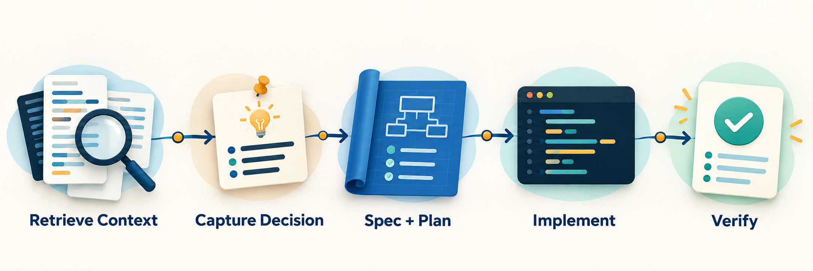

# agent-devkit

[Tiếng Việt](README.vi.md)

Evidence-first, spec-driven workflow toolkit for coding agents — with semantic
code retrieval, token-aware context flow, and hard review gates.

Turn a vague request into a traceable change:



## Core capabilities

| Capability | What it gives the agent |
|---|---|
| Semantic / RAG-style code retrieval | Optional OpenEZ semantic search, graph traversal, and caller analysis; direct source remains authoritative. |
| Spec- and plan-driven delivery | Approved designs, behavior-level plans with named test cases, persisted impact maps, edge-case coverage, and explicit implementation gates. |
| Token-aware context management | Focused source retrieval, compact handoffs, and evidence instead of dumping the whole repository into context. |
| Evidence-first verification | Fresh tests/checks, precise `path:line` findings, and failing `cannot verify` gaps when proof is missing. |
| Convention capture and enforcement | Repository-specific rules with provenance, approval, scoped precedence, and review evidence. |
| Whole-repository lean audit | Report-only `delete`, `stdlib`, `native`, `yagni`, and `shrink` findings with no auto-fix. |

## What it does

Coding agents need accurate, up-to-date context to work effectively. This
project provides portable Markdown skills for bootstrapping repository context,
retrieving code relationships, designing and planning changes, implementing
with local conventions, debugging root causes, verifying fresh evidence, and
maintaining a source-grounded LLM wiki.

Plans specify behavior and checks; `implement-task` writes code. An exact,
low-risk, non-bug change may proceed without waiting for design approval only
after `brainstorm-feature` verifies its named scope and impact map.

## Skills

Skills are prompt-driven Markdown playbooks under `skills/`. Each skill has a
`name`, `description`, and step-by-step instructions. No scripts — the agent
follows the instructions directly.

## Using the skills

Skills are portable folders, not application dependencies. To use them, make
the `skills/<name>/` folder visible to the agent's skill loader, then invoke
the skill by name or ask for the task it describes. `SKILL.md` is the required
file; `agents/openai.yaml` only adds Codex/OpenAI UI metadata.

### Harness packaging

This repository is the source tree for developing skills. Keep canonical skill
files under `skills/`; do not add an installation mirror under
`.agents/skills/`.

- **Codex:** `.codex-plugin/` and `hooks/hooks.json` provide the optional plugin
  integration and `SessionStart` bootstrap.
- **Claude Code:** `.claude-plugin/` points to
  `hooks/claude-codex-hooks.json` and reuses the same `skills/` and script.
- **Cursor:** `.cursor-plugin/` points to `hooks/cursor-hooks.json` and reuses
  the same `skills/` tree and script.
- **Devin CLI:** `.devin-plugin/` packages the same `skills/` tree as a Devin
  plugin.
- **OpenCode:** `.opencode/plugins/agent-devkit.js` registers the canonical
  `skills/` tree and bootstraps `using-devkit` through OpenCode's plugin API.

The target project, not this source repository, owns its `AGENTS.md` and
`.agents/skills/` installation files.

This repo also exposes the Codex plugin through the repo-scoped marketplace at
`.agents/plugins/marketplace.json`. Users can install it directly from GitHub:

```bash
codex plugin marketplace add asta-nguyen/agent-devkit --ref main
codex plugin add agent-devkit@agent-devkit
```

Use `codex plugin marketplace upgrade agent-devkit` after pushing updates, then
start a new Codex thread to load the new plugin version.

Claude Code users can install the same plugin from the Claude marketplace:

```bash
claude plugin marketplace add asta-nguyen/agent-devkit
claude plugin install agent-devkit@agent-devkit
```

Refresh it after pushing updates with `claude plugin marketplace update
agent-devkit`, then run `/reload-plugins` in Claude Code.

Cursor users can import the repository through a Cursor team marketplace, or
test it locally by placing this repository under
`~/.cursor/plugins/local/agent-devkit` and reloading the Cursor window.

Devin CLI users can install the plugin directly from GitHub:

```bash
devin plugins install asta-nguyen/agent-devkit
```

OpenCode uses its own plugin install. In the target project's `opencode.json`,
add the Git-backed plugin:

```json
{
  "$schema": "https://opencode.ai/config.json",
  "plugin": [
    "agent-devkit@git+https://github.com/asta-nguyen/agent-devkit.git"
  ]
}
```

Restart OpenCode after changing the config. The plugin registers the bundled
skills and injects `using-devkit` into the first user message.
The current adapter targets OpenCode 1.x; OpenCode V2 will require its separate
plugin API adapter when V2 becomes the supported release.

For a project that discovers repository-local skills from `.agents/skills`,
run this from the target project and replace the source path with this clone:

```bash
mkdir -p .agents/skills
cp -R /path/to/agent-devkit/skills/. .agents/skills/
find .agents/skills -name SKILL.md -print
```

### Install with Agent Skills CLI

This repository follows the open Agent Skills layout: each skill is a
`skills/<name>/SKILL.md` with YAML frontmatter containing `name` and
`description`. No `skill.json` is required.

Install all skills into Claude Code with:

```bash
npx skills add asta-nguyen/agent-devkit -a claude-code
```

The public repository is currently `asta-nguyen/agent-devkit`; the shorthand
`asta/agent-devkit` is not the repository's current GitHub path.

Install the whole set because the workflow skills reference each other; keep
each skill folder intact so its supporting references are installed. Treat the
copies as managed files: do not customize them in the target project. Updating
overwrites same-named skills, and retired skill folders must be removed manually.
Start a fresh agent session after copying so its skill list is reloaded.

The shortest routing guide is:

```text
using-devkit                          # choose the right workflow skill
setup-codebase                         # first visit to a repo missing context
setup-openez                           # optional setup/refresh when needed and approved
read-codebase-context                  # understand code before changing it
context-handoff                        # checkpoint unfinished work before pausing
document-wiki                          # document existing app features
lean-audit                             # audit whole-repo simplicity; report only
brainstorm-feature → plan-feature      # architectural work: save spec then plan
estimate-feature                       # optional per-task AI-assisted estimate
implement-task → review-and-verify     # review, fix blockers once, review again
systematic-debugging                   # investigate before fixing bugs
```

## OpenEZ

OpenEZ is a separate code-intelligence MCP service. Install/index a repository
and wire the clients you use, then restart those clients so their MCP tools are
loaded:

```bash
openez init <repo-path>
openez index <repo-path>
openez setup codex                  # or claude / opencode
```

Skills use this tool-by-purpose flow:

| Stage | Need | Tool |
|---|---|---|
| Locate | Concept or behavior | OpenEZ `code_query` |
| Locate | Approximate filename | FFF fuzzy file find |
| Locate | Identifier or literal | FFF grep, falling back to `rg` |
| Locate | Regex | `rg` |
| Expand | Callers and callees | OpenEZ `code_context` (1–2 hops) |
| Confirm | Dynamic or registration references | FFF multi-pattern grep, falling back to `rg` |
| Read | Large-file structure and evidence | OpenEZ `code_outline`, then read current source directly |

Search and index results are navigation, never evidence. A plugin is optional:
use one to distribute a skill, MCP server, and optional UI together; a shared
`SKILL.md` folder is enough for the workflow itself.

### Optional: FFF search

FFF adds a background watcher that updates an in-memory content index when it
detects file changes, including uncommitted edits. It also provides
frecency-ranked fuzzy file find, multi-pattern grep in one call, and git-aware
annotations for modified, untracked, and staged files. See the [official FFF
README, MCP server section](https://github.com/dmtrKovalenko/fff).

It can help in large repositories or monorepos with repeated searches,
approximate filename lookups, caller/reference sweeps during review or
lean-audit, or alongside OpenEZ when files changed after the last index. Costs
are RAM for the content index, a background watcher, per-client MCP
configuration, and a startup update check. For fff-mcp 0.11.0,
`--no-update-check` is documented by `fff-mcp --help`, not the README.

| OS | Install |
|---|---|
| macOS / Linux | <code>curl -L https://dmtrkovalenko.dev/install-fff-mcp.sh &#124; bash</code> |
| Windows (PowerShell) | <code>irm https://raw.githubusercontent.com/dmtrKovalenko/fff/main/install-mcp.ps1 &#124; iex</code> |
| macOS / Linux (Homebrew) | `brew install dmtrKovalenko/fff/fff-mcp`<br>`brew upgrade fff-mcp` for later updates |

Read the install script before piping it to a shell. For MCP registration, use
an absolute binary path because desktop clients may not inherit the shell
`PATH`: the one-line installer defaults to `$HOME/.local/bin/fff-mcp`,
Homebrew to `$(brew --prefix)/bin/fff-mcp`, and Windows prints its path.

The official Codex example is:

```sh
codex mcp add fff -- "$(brew --prefix)/bin/fff-mcp"
```

This creates an entry in `~/.codex/config.toml` like:

```toml
[mcp_servers.fff]
command = "/absolute/path/to/fff-mcp"
```

To skip the startup update check, add this separately by hand; it is not
produced by the command above:

```toml
args = ["--no-update-check"]
```

For other clients, follow their official docs or the installer's printed
instructions; this guide does not invent client-specific snippets:
[Claude Code](https://code.claude.com/docs/en/mcp),
[Cursor](https://docs.cursor.com/context/model-context-protocol),
[OpenCode](https://opencode.ai/docs/en/mcp-servers/), and
[Devin](https://docs.devin.ai/cli/extensibility/mcp/configuration). Restart
the client after setup.

In fff-mcp 0.11.0 the tools are `find_files`, `grep`, and `multi_grep`; the FFF
README calls them `fffind`, `ffgrep`, and `fff-multi-grep`. These are version
examples; use the connected server's tool list if names differ. Say “FFF grep”
for this capability. FFF grep uses literal identifiers; regex stays with
`rg`. Do not copy a blanket “use FFF for any search” instruction into
`CLAUDE.md` or `AGENTS.md`; devkit routing remains authoritative and FFF is
optional.

FFF is never required. Without it, skills use `rg` and reach the same results.

### Bootstrap & context

| Skill | Purpose |
|---|---|
| `using-devkit` | Route a task to the correct devkit workflow before editing. |
| `setup-codebase` | Create missing context files and capture missing repository conventions; safe to rerun when conventions are absent. |
| `setup-openez` | Ask before CLI install, existing `AGENTS.md` guidance, or client wiring; report CLI indexing and MCP verification separately, including an unverified MCP query when tools do not load. |
| `read-codebase-context` | Choose search by the question and trace code paths before feature work or wiki generation. |
| `context-handoff` | Save a compact evidence checkpoint when a session must pause or is approaching its context limit. |

### Feature development

| Skill | Purpose |
|---|---|
| `brainstorm-feature` | Classify scope, clarify and get design approval; route Spike to investigation, Bounded to implementation, and Architectural through a plan. |
| `plan-feature` | Save an approved architectural plan under `docs/agent-devkit/plans/` with bite-sized, verifiable tasks. |
| `estimate-feature` | Optionally estimate every completed plan task in AI-assisted engineering hours. |
| `implement-task` | Execute an approved plan: trace code, make the smallest change, verify, then flag wiki coverage. |
| `systematic-debugging` | Find root cause, classify the bug, define verification, then fix bounded bugs or hand architectural bugs off for design. |
| `review-and-verify` | Iron Law: no completion claims without fresh evidence. Diff review, code review reception, red flags. |

### Auditing

| Skill | Purpose |
|---|---|
| `lean-audit` | Audit a whole repository for over-engineering and bloat; report validated simplicity cuts without applying fixes. |

### Wiki lifecycle

| Skill | Purpose |
|---|---|
| `document-wiki` | Build a source-grounded domain baseline, then let the user choose undocumented features or confirmed content gaps. |

Deep pages use evidence-backed folders only when needed: `architecture/` for
system structure, `domains/` for state and business rules, `workflows/` for
user/operator flows, `integrations/` for external systems, `operations/` for
jobs/cron/deployment, and `decisions/` for source-backed decisions. Small repos
may need only `architecture/` and `workflows/`; empty folders are never created.

## Example workflows

### 1. Bootstrap a new repository

```
setup-codebase
  → creates AGENTS.md, CLAUDE.md, docs/llm/ skeleton
  → ignores local Obsidian artifacts and .openez index data
```

Invoke `setup-codebase` in an agent session; it reads repository evidence and
creates only missing, project-specific context files. It also appends missing
`/docs/.obsidian/`, `/docs/Untitled*.md`, `/docs/Untitled*.canvas`, and
`.openez/` rules to `.gitignore` without untracking existing files.

### 2. Implement a feature from scratch

```
brainstorm-feature        → clarify scope, get design approval
  ↓
docs/agent-devkit/specs/  → save approved architectural design
  ↓
setup-codebase            → new projects only: create initial contract
  ↓
plan-feature              → save ordered plan under docs/agent-devkit/plans/
  ↓
estimate-feature          → optional: save per-task ranges under docs/agent-devkit/estimates/
  ↓
implement-task            → code, verify, run checks
  ↓
review-and-verify         → pass/fail report with evidence and blockers
  ↓
fix blockers once, then review again; stop if still failing
  ↓
document-wiki             → refresh documentation for the changed feature
```

### 3. Debug a bug

```
systematic-debugging          → investigate and classify
  ├─ Diagnostic investigation → report evidence and stop
  ├─ Architectural            → brainstorm-feature → plan-feature
  └─ Bounded                  → verify plan → regression check → fix
                              ↓
                              review-and-verify
```

### 4. Document an existing app

```
setup-codebase             → create the missing wiki skeleton
  ↓
document-wiki              → create or refresh the domain baseline map;
                              then choose undocumented features or confirmed gaps
```

## License

MIT — see [LICENSE](./LICENSE).
